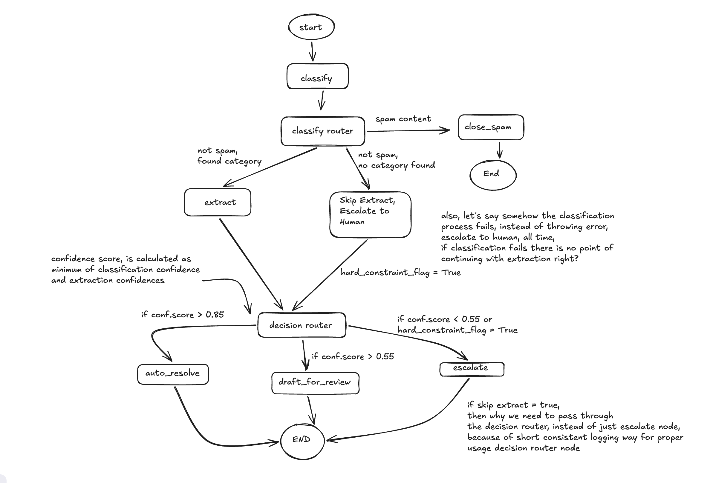

# ticket-assignment

An automated support-ticket triage agent built on LangGraph. Each incoming
ticket is classified, optionally has structured fields extracted, and is
then routed to one of three outcomes: auto-resolved with a generated reply,
drafted for human review, or escalated to a human entirely.

## Flow



- **classify** — categorizes the ticket and produces a confidence score.
- **classify router** — spam is closed immediately with no reply
  (`close_spam`); tickets that fail to classify skip extraction and go
  straight to the decision router so the failure is still recorded as a
  proper `escalate` decision (see `agent/edge.py::classify_router`).
- **extract** — pulls structured fields out of the ticket body for
  categories that need them.
- **decision router** (`agent/route.py::route_decision`) — the single gate
  that sets `state["decision"]`. Combined confidence is the minimum of
  classification confidence and extraction confidence (when extraction
  ran). Every path — including a classify failure or a skipped extraction —
  passes through here so the ticket's `decision` and audit trail are always
  set consistently, and `escalate` is always reached the same way (via
  `route_selector` reading `state["decision"]`).
- **auto_resolve / draft_for_review / escalate** — terminal nodes based on
  the decision.

## Getting started

```bash
make install   # uv sync
make run       # start Postgres, apply migrations, launch the Streamlit app
make eval      # start Postgres, apply migrations, run the eval harness
```

See the `Makefile` for the full list of targets (`db-down`, `db-reset`, etc).

## Requirements

- Python >= 3.12
- Docker (for the Postgres dependency in `docker-compose.yml`)
- An `OPENROUTER_API_KEY` set in `.env` (LLM calls go through OpenRouter)
